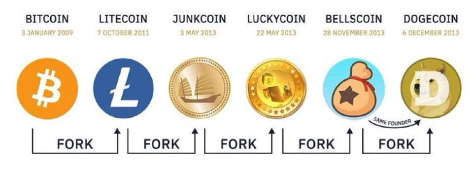

# Bellish

#### Disclaimer:

Nothing in this page is to be taken as Financial Advise, please do not.\
I repeat. Nothing in this page is to be taken as Financial Advise.

<figure><figcaption></figcaption></figure>

### Introduction

BellsChain is a restart of the original Bellscoin that was created by Billy Markus. He created Bellscoin by forking Luckycoin code. He then used this existing code for Dogecoin, and the rest is history.&#x20;

Billy Markus created both Dogecoin and Bellscoin. The OG meme and the Doge Daddy.\
You can see the complete lineage below.&#x20;

<figure><figcaption></figcaption></figure>

BellsChain is now merge-mined with Litecoin and Dogecoin since August 18, 2024. Which makes it one of the most secure chains in the Scrypt Ecosystem. It will not die again until the last Litecoin miner is hashing.

## Bellish Content

Here are some recommended articles and videos where you can learn more about BellsChain ($BELLS). Kudos to the community for sharing all these valuable insights and educational content.\
\
LFG

### Bellish Articles

* [Bellscoin Investment Thesis](https://medium.com/@bellscoin/bellscoin-investment-thesis-307190c0ce03) by [ScryptSupremacy](https://x.com/ScryptSupremacy)
* [Once there “WAS” a forked Bellscoin](https://medium.com/@bellscoin/once-there-was-forked-bellscoin-d39bc9c9248a)
* [What BillyM2K said about Bellscoin](https://medium.com/@bellscoin/what-billym2k-said-about-bellscoin-fcbdf4056aae)
* [What BillyM2K said about Bellscoin (2)](https://medium.com/@bellscoin/what-billym2k-said-about-bellscoin-2-21dcc1765287)
* [How to do Merge Mining LTC+DOGE+BEL](https://medium.com/@bellscoin/how-to-do-merge-mining-ltc-doge-bel-210f96deee71)

Go to The Bellscoin Blog by [BellsChain](https://x.com/BellsChain) for more.



### Bellish Videos

* [What is Bellscoin? w/Adam McBride](https://www.youtube.com/watch?v=ILp5KriqlYU\&pp=ygUJYmVsbHNjb2lu)
* [The Next Billion Dollar Meme Coin...Bellscoin Interview](https://www.youtube.com/watch?v=2Bl8jMDIZUc\&pp=ygUJYmVsbHNjb2lu)
* [Adam McBride on Bellscoin: the Original Memecoin & Forgotten Parent of Doge](https://www.youtube.com/watch?v=3GHKwvxkU2Y\&pp=ygUJYmVsbHNjb2lu)
* [How To Mine Bellscoin BEL with Dogecoin and Litecoin!](https://www.youtube.com/watch?v=R2E2iXpeOf4\&pp=ygUJYmVsbHNjb2lu)
* Bells Corner with Adam McBride, by [OrdinalRevolution](https://www.youtube.com/@OrdinalRevolution) (Multiple Episodes)
* [The Next DOGE!? BellsCoin](https://www.youtube.com/watch?v=2cRz51xscBU)

### Bellish Spaces

* [PoW Guardians Series - LTC\&Doge\&BELL](https://x.com/ETCGrantsDao/status/1846635572959629762)
* [Between 2 Degens w/ @LukeWrightmain](https://x.com/i/broadcasts/1OyKAZAEDZaGb)
* [Bellscoin 11th Anniversary ](https://x.com/adamamcbride/status/1862246454422655003)

### BellsChain Upcoming Milestones

Go here: [https://bells.wtf/](https://bells.wtf/)

Thanks for reading. [Here is picture of Litecoin + Dogecoin and Bells](https://x.com/litecoin/status/1865011809994117233)

<figure><figcaption></figcaption></figure>

### How to Support BellsChain

* Support Nintondo Developers: [https://github.com/Nintondo/ord?tab=readme-ov-file#donate](https://github.com/Nintondo/ord?tab=readme-ov-file#donate)
* Listings and Liquidity Providers: [https://donation.bellscoin.com/](https://donation.bellscoin.com/)

## Bellscoin Resources

Official Site: [https://bellscoin.com](https://bellscoin.com/)\
Explorer: [https://nintondo.io/explorer](https://nintondo.io/explorer)

### How to Buy $BELLS

Centralized Exchanges (includes referral link):

* [NonKYC](https://nonkyc.io/?ref=658045d205279ea14f3a7169)
* [CoinEX](https://www.coinex.com/register?refer_code=38a4q)
* [Gate.io](https://www.gate.io/ref/VlVGBgoN?ref_type=102)
* [MEXC](https://www.mexc.com/register?inviteCode=13dUe)

[DEXScreener](https://dexscreener.com/solana/BELLSsjNh6715KiorEhPw5NMt1AVuDdiwMYmkN4tBS5D) (Use a Solana Wallet)

<figure><figcaption></figcaption></figure>

### My Bellscoin Research

* [The Genesis Block message is the same](https://x.com/ZachZwei/status/1862512487868112906)
* [The Bellscoin logo on the Dogecoin client](https://x.com/ZachZwei/status/1862897218107453770)
* [AI comparing repos of Luckycoin, Bellscoin and Dogecoin to explain lineage](https://x.com/ZachZwei/status/1863226678740492632)
* [Vice article interview with Billy (oldest mention of Bells)](https://x.com/ZachZwei/status/1864928815597928774)
* [Doge dev knows about Bells](https://x.com/ZachZwei/status/1865777254904852755)
* [The Bellscoin Logo on OG Dogecoin client (video)](https://x.com/ZachZwei/status/1863270288974344270)
