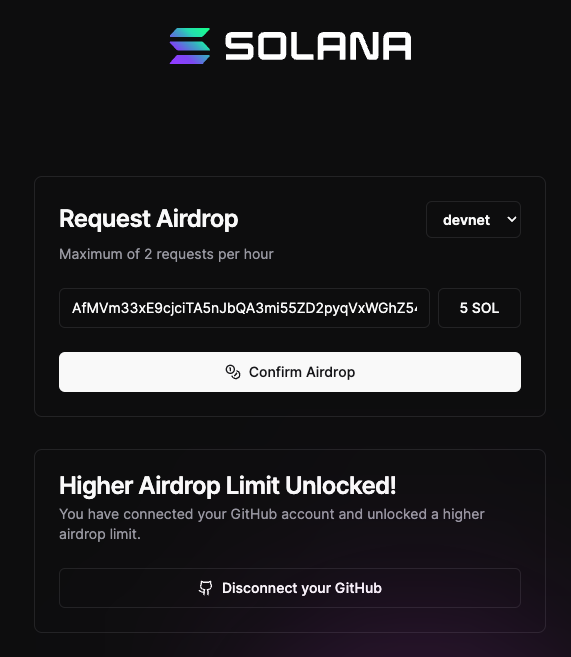

# SolXEN Miner (DevNet) Go Edition

**Disclaimer!**&#x20;

Not Financial Advise. Educational purposes only.&#x20;

This is running purely on [Solana DevNet](https://explorer.solana.com/?cluster=devnet).

Tested on a 10-Core CPU server with Ubuntu 22.04.

Official site: [https://github.com/mmc-98/solxen-tx](https://github.com/mmc-98/solxen-tx)


### Install Go

```
wget https://go.dev/dl/go1.22.1.linux-amd64.tar.gz
rm -rf /usr/local/go && tar -C /usr/local -xzf go1.22.1.linux-amd64.tar.gz
eval $(echo 'export PATH=$PATH:/usr/local/go/bin' | sudo tee /etc/profile.d/golang.sh)
eval $(echo 'export PATH=$PATH:$HOME/go/bin' | tee -a $HOME/.profile)
echo "export PATH=$PATH:/usr/local/go/bin:$HOME/go/bin" >> $HOME/.bash_profile
source $HOME/.bash_profile
```

Check Go version

```
go version
```

### Download Miner

Choose the file that corresponds to the machine that you are using.\
Go here: [https://github.com/mmc-98/solxen-tx/releases](https://github.com/mmc-98/solxen-tx/releases)

<figure><figcaption></figcaption></figure>

In my case, I am running the miner on a Linux Server.

Run the following command:

```
wget https://github.com/mmc-98/solxen-tx/releases/download/v0.03/solxen-tx-v0.03-linux-amd64.tar.gz
```

Extract the miner:

```
tar -vxzf solxen-tx-v0.03-linux-amd64.tar.gz
```

Make it executable:

```
chmod +x solxen-tx
```

### Configure Miner

```
nano solxen-tx.yaml    
```

<figure><figcaption></figcaption></figure>

Put your Private Key from your Solana Wallet (Use a burner).&#x20;

You can get it from Phantom.

<figure><figcaption></figcaption></figure>

\
Replace `ToAddr:` to your own ETH address.\
Change Program ID to:  Dx7zjkWZbUStmhjo8BrhbprtQCcMByJgCTEC6TLgkH8n

Save file.

Note: SolXEN mining is still in development, so there might be changes that are being done to the contract. Always check if you are running the latest Program ID.


### Get SOL Devnet Tokens

Go here [https://faucet.solana.com/](https://faucet.solana.com/) and Enter your SOL address.

Make sure that you are requesting **Devnet** tokens.

If you have a GitHub account, you can request more tokens.

<figure><figcaption></figcaption></figure>


### Run SolXEN miner

```
./solxen-tx
```

<figure><figcaption></figcaption></figure>

Congratulations, you are now mining SolXEN.

You can check the transactions here: [https://explorer.solana.com/?cluster=devnet](https://explorer.solana.com/?cluster=devnet)

Just search for your address and then tap on a transaction to review it.

<figure><figcaption></figcaption></figure>

Check your SolXEN tokens by going to the Tokens tab of the explorer.

<figure><figcaption></figcaption></figure>

Join SoLXEN Telegram: [https://t.me/+rrWU85yki-k3MzRj](https://t.me/+rrWU85yki-k3MzRj)
